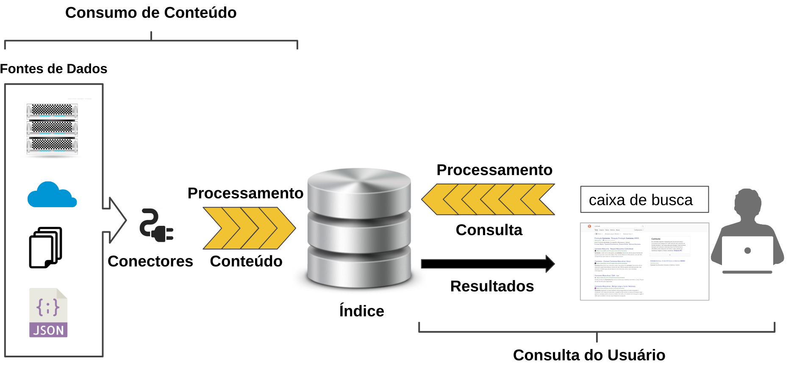
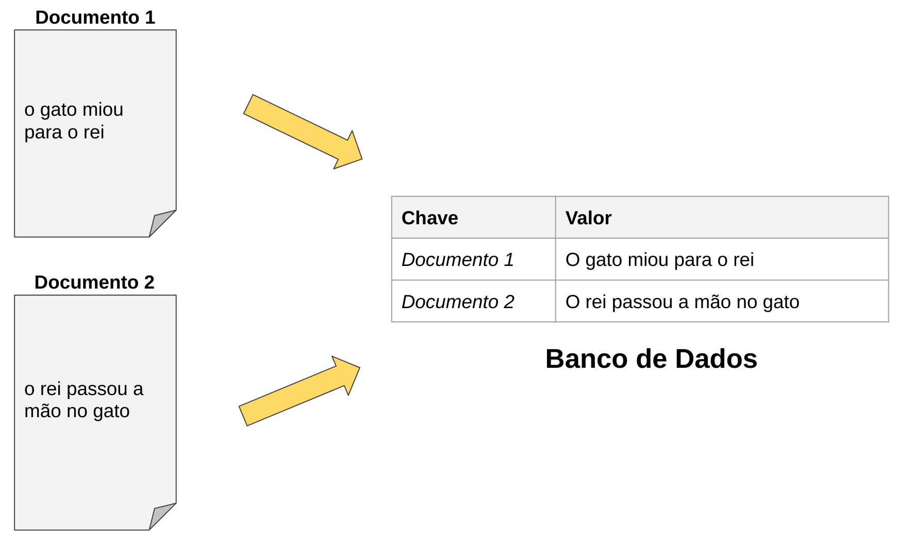
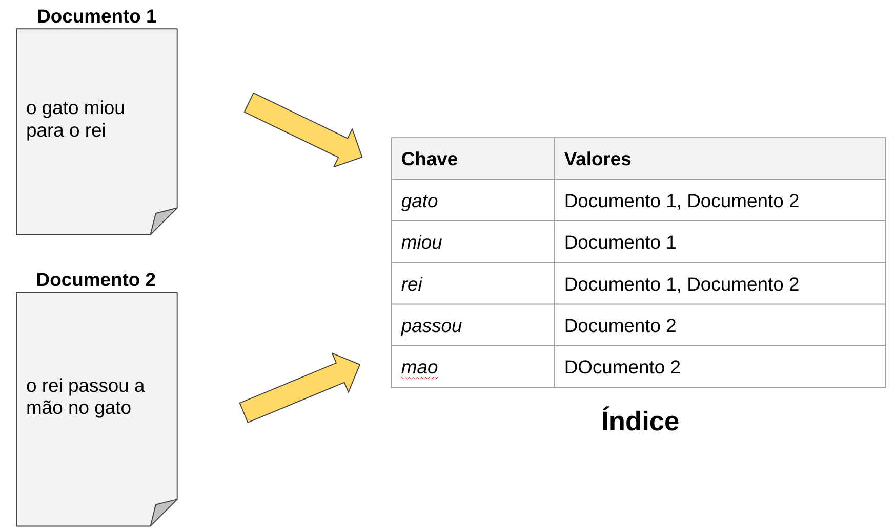

# Um título bonitão para isso

Hoje em dia é comum utilizar máquina de busca para pesquisar conteúdo na internet como Google, DuckDuckGo, Bing, Yahoo, dentre outras. Costumamos usá-las sem questionar ou interessar-se em: Como o conteúdo foi parar lá? Como é feita a ordenação do resultado? Como pesquisar de forma simples e eficaz? Como dar a resposta rapidamente ao usuário?

Pensando nessas perguntas, discutiremos nesse artigo sobre como as máquinas de busca funcionam.

## O que uma máquina de busca propõe resolver?

Para contextualizar, inicialmente falaremos sobre a importância da máquina de busca na internet. Quando a internet popularizou existiam sites de diversos temas, era difícil descobri-los sem recomendações de pessoas, com isso, surgiram sites com o conceito de organizar e facilitar a busca de conteúdos na internet.

O primeiro buscador na internet foi o Wandex desenvolvido pelo Matthew Gray no MIT, depois vieram outros até chegar nos tempos de hoje com os gigantes Yahoo, Bing e Google.

Atualmente qualquer site possui uma máquina de busca. Em todo e-commerce haverá uma caixa de busca que utilizará os mesmos conceitos dos gigantes da internet unificando todo conteúdo através de uma simples consulta. Pode-se notar que é uma tecnologia amplamente difundida em empresas de todos os portes.

Para explicar como uma máquina de busca funciona dividiremos o conceito em duas partes:
1. O consumo de conteúdo de fontes como, sites, imagens, notícias
2. Consulta do usuário

#### Consumo de Conteúdo
	
Esta etapa pode ser conhecida como Crawler quando se trata de conteúdo para internet. Podemos pensar em um Crawler como um robô que varre todo seu site, armazenando todo o conteúdo na base de dados (índice) da máquina de busca. Mas o consumo de conteúdo também pode ser uma integração entre sistemas.
	
#### Consulta do Usuário

É responsável por ajudar o usuário a buscar o conteúdo mais relevante para sua consulta e auxiliar no estágio da pesquisa. Essa fase envolve outros componentes como “Vocês quis dizer?”, “Filtros” e “Auto completar”.	

Dado esse contexto, podemos detalhar os componentes de uma máquina de busca da seguinte forma:

#### Conectores
Ajuda no trabalho de conectar em diversas fontes de dados, como varrer um site, fazer integrações com outros sistemas (API) e rastrear um sistema de arquivos. Sua responsabilidade é injetar dados para dentro da máquina de busca.
		
#### Processamento de Conteúdo
Responsável por processar todos os dados injetados pelos conectores e, por todo o processamento de normalização linguística e enriquecimento de dados para o conteúdo ficar buscável pelo usuário. Vale ressaltar que essa etapa é uma das mais importantes de uma máquina de busca.	

#### Índice 
responsável por armazenar os dados normalizados para busca do usuário. Geralmente é visto como uma tabela de um banco de dados, mas o conceito é diferente. 

Segue abaixo uma representação de dois documentos gravados em um banco de dados:  

Como podemos observar acima, a chave do banco de dados tem um valor único que possibilita fazer uma busca simples. Se tivermos a necessidade de procurar pelo "valor" do documento, a busca se torna inviável, pois teremos que processar o texto do documento. 

Na estrutura de índice invertido, que é utilizado por máquina de busca, esse conceito é diferente:

As chaves são palavras do texto e os valores são os ids dos documentos (documento 1 e documento 2). Os artigos e preposições foram removidos para economizar espaço e deixar somente palavras relevantes.

Ao contrário de um banco de dados relacional, a busca nessa estrutura de dados é mais eficiente, porque todas as palavras são chaves. Entretanto,  é necessário normalizar o processamento da consulta do usuário. 

#### Processamento de Consulta
Nesta etapa aplicamos tratamento linguístico com os mesmos padrões do índice, para que possamos encontrar o documento perfeito para a busca. É possível fazer enriquecimento da consulta como sinônimos, tratamento de erros ortográficos, dentre outros.

### Para finalizar...

Podemos notar o quão importante é uma máquina de busca em nosso cotidiano quando nos damos conta de que é quase impossível começar sua jornada na internet sem realizar uma busca.

Dia após dia, empresas investem em pesquisas com a proposta de modernizar e torná-las mais eficientes.

Nos próximos artigos aprofundaremos como os dados são normalizados no índice de busca.

Muito obrigado e até o próximo artigo. 
