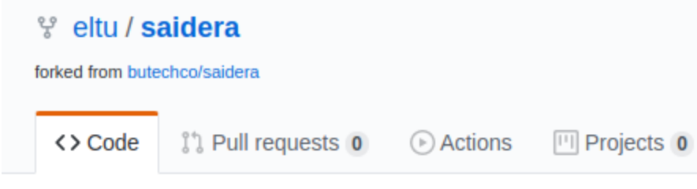
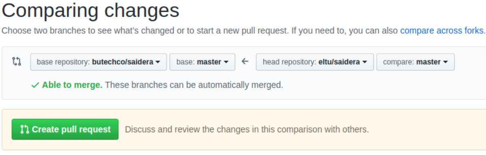
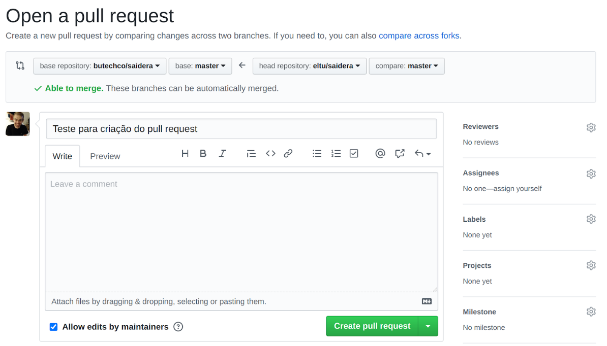
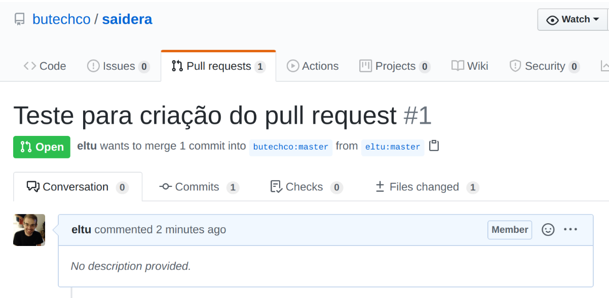
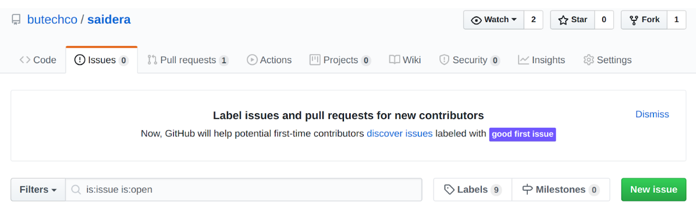
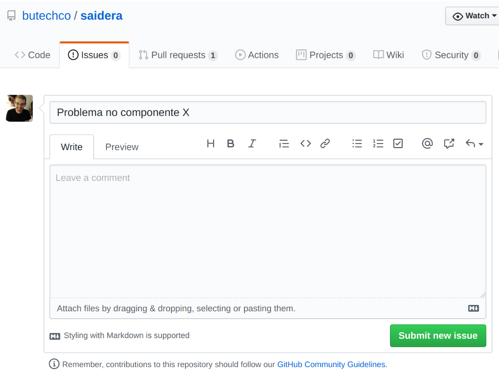
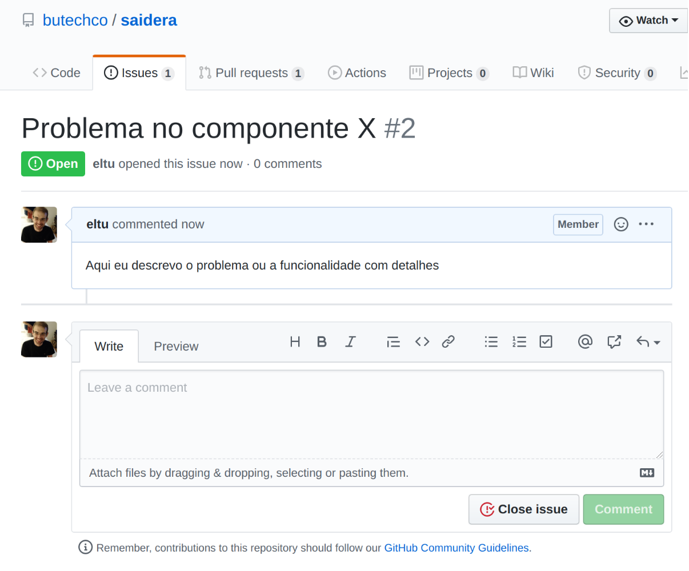

# Contribuindo com projetos Open Source

Hoje em dia é comum utilizarmos o software open source em nossas aplicações ou até mesmo no nosso dia a dia em nossos computadores pessoais. 

Temos diversos casos de sucesso de projetos open source como Solr e ElasticSearch e o mais famoso o Linux, que além de open source é software livre.
Mas, por que consumimos projetos open source e não contribuímos?

Acredito que isso seja porque não sabemos como contribuir. Nós podemos contribuir de diversas maneiras e não apenas com código, mas com documentação, com divulgação do projeto, ajudando novos usuários, reportando erros, solicitando funcionalidades, enfim, diversas formas.

A grande virtude de contribuirmos com projetos open source é ganharmos conhecimento independente da forma de contribuição, contando com pessoas de outras culturas e empresas, isso traz um crescimento profissional e pessoal.

O que gostaria de mostrar a partir de agora  é como utilizar o github para contribuir com projetos open source.

## Contribuição com código no GitHub

Para começar a contribuir com código em um projeto primeiro passo é fazer um fork para seu perfil do github, para isso entre entre no projeto nomeu caso https://github.com/butechco/banheiro e click em:

    

Exibirá uma de confirmação perguntando se realmente gostaria de fazer o Fork daquele repositório para sua conta do GitHub, clique em cima no nome do seu usuário para realizar o Fork

    

Após concluir o fork para sua conta o repositório estará disponível no seu perfil:

    

Faça todas as alterações necessária no projeto como desejar e após as alterações estarem na MASTER do seu fork crie um pull request:

    

Após clicado em “New pull request” selecione o “base repository” (projeto qual foi feito o fork) e head repository (o fork realizado), como é mostrado na imagem abaixo: 

    

Agora basta digitar o título do seu pull request e comentários que desejar do seu pull request e clique em “Create pull request”:

    

Seu pull request será criado no repositório origem no meu caso “butechco/saidera”

    

Pronto! você acabou de contribuir com código em um projeto open source. Simples não?

### Issues

Utilizamos Issues para reportar bug ou novas funcionalidades. Para utilizar é bem simples, no repositório de origem (butechco/saidera) basta clicar na aba “issues” e clicar em “new issue” como mostrado abaixo: 

    

Depois basta criar o issue colocando um título e detalhando o bug ou a funcionalidade:

    

Além de criar nova issues você pode também responder issues criadas por outros usuários. =)

    

### Pronto! Agora é só contribuir!

Como pudemos observar é muito fácil contribuir com projetos open source. Quanto mais contribuímos mais fortalecemos o projeto e sua maturidade, com isso passamos apenas de um simples usuário passivo de projeto open source para um usuário ativo, de além de utilizar também contribui.

Por hoje é isso! Meu queridão, passa a régua para nós? 
	

